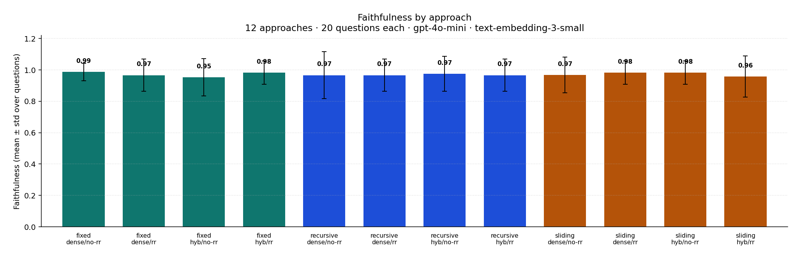
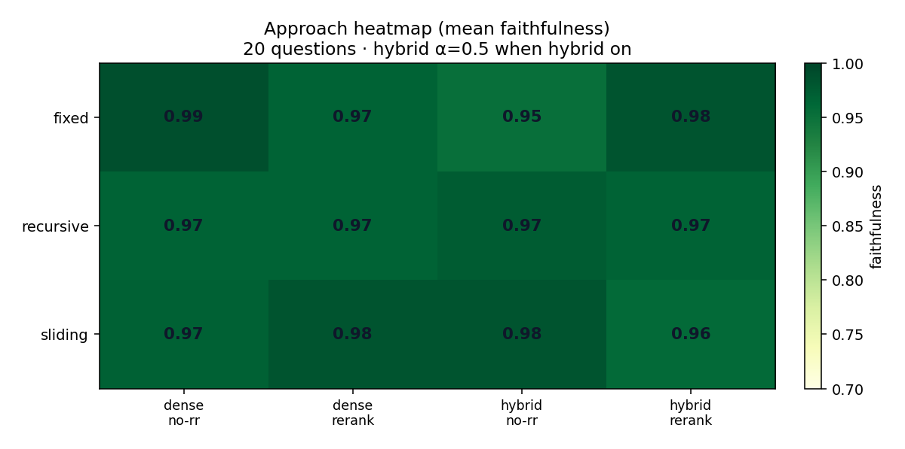

# Corpus RAG — Case Study Deliverable

Semantic search + grounded RAG over a document corpus, with an admin dashboard and an MCP search tool. Built as a TypeScript monorepo.

After deploy, demo accounts are seeded from `DEMO_USER_PASSWORD` / `DEMO_ADMIN_PASSWORD` in `.env` (see `.env.example`).

## What this application does

1. **Ingests** markdown/text documents (chunk → embed → Qdrant)
2. Lets users **ask questions** and get **grounded answers with citations**
3. Lets admins **manage/observe** the corpus, ingestion jobs, index health, and search analytics
4. Exposes the same retrieval as an **MCP `search` tool** for external clients

If the corpus does not contain enough evidence, the system says so instead of inventing facts.

## Features list

### Must-haves
- pnpm monorepo: `apps/web`, `apps/api`, `packages/shared`
- Ingestion pipeline with job status (`pending/running/succeeded/failed`), per-file success/fail, content-hash skip
- Three chunking strategies with separate Qdrant collections:
  - `fixed` (512 / 64 overlap)
  - `recursive` (structure-aware; default for chat)
  - `sliding` (256 / 32)
- Chat page with **SSE streaming** answers (`/api/chat/stream`): passages first, then token deltas, clickable `[n]` citations
- Admin dashboard: documents, ingest trigger, jobs, Qdrant index health, search stats
- Admin **Users** panel: list users, invite (email + initial password), change roles
- MCP `search` tool: **remote Streamable HTTP** (`/mcp`, OAuth login) + local stdio — see [MCP server](#mcp-server-search)
- AuthN/Z via Better Auth: roles `user` | `admin`; Google social login; MCP OAuth (same accounts)

- `AI_USAGE.md`
- `.env.example` + auto migrate/seed on API boot

### Extras / polish
- Full Docker Compose stack (Postgres, Qdrant, pgAdmin, API, Web)
- Auto-ingest on boot when indexes are empty (all three strategies)
- **Self-updating pipeline**: chokidar watches `CORPUS_PATH`; on add/change/delete runs incremental ingest (content-hash skip + removed-file sync) — no full manual rebuild required
- RFC 9457 `application/problem+json` errors
- Trace IDs (`x-trace-id` / ALS context) + structured pino logs
- Transient retries for OpenAI / Qdrant
- RAGAS faithfulness eval harness under `evals/`
- Register page + role-gated dashboard
- **Dense + BM25 hybrid (α)** + OpenAI rerank: fuse `s = α·densê + (1−α)·BM25̂` (chat UI α slider + formula), then optional rerank to `TOP_K`

## Technology stack

| Layer | Tech |
|-------|------|
| Monorepo | pnpm workspaces |
| Web | Next.js 15, Tailwind CSS 4, shadcn-style UI, sonner |
| API | Express, lite clean architecture (ports & adapters) |
| Auth | Better Auth (email/password + Google OAuth, httpOnly session cookies) + `role` on `user` + MCP OAuth plugin |
| DB | PostgreSQL + Drizzle ORM (Neon in prod) |
| Vector DB | Qdrant (`@qdrant/js-client-rest`; Qdrant Cloud in prod) |
| Models | OpenAI `text-embedding-3-small` + `gpt-4o-mini` |
| MCP | `@modelcontextprotocol/sdk` — Streamable HTTP `/mcp` (OAuth) + stdio |
| Deploy | Vercel Services (`web` + `api` container) — see [Deployment](#deployment-vercel-services) |
| Observability | pino + `x-trace-id` / `x-request-id` |
| Admin UIs | pgAdmin, Qdrant dashboard |

## Design choices (why)

- **Qdrant separate from Postgres** — vectors scale independently; relational data (users, jobs, analytics) stays simple in PG.
- **Per-strategy collections** (`chunks_fixed|recursive|sliding`) — clean A/B without payload filters fighting each other.
- **Recursive default** — corpus is mostly short markdown/sections; structure-aware splits preserve topical coherence.
- **Grounded JSON contract** — LLM returns `{ answer, grounded, citations }`; empty retrieval short-circuits to “not in corpus”.
- **Dense + BM25 hybrid (α)** — candidates from Qdrant dense and in-house Okapi BM25 (payload text); min–max normalize; `s = α·densê + (1−α)·BM25̂`. Chat/MCP pass `useHybrid` / `hybridAlpha`.
- **Dense retrieve → OpenAI rerank** — after hybrid (or dense-only), optional `gpt-4o-mini` rerank; `useRerank` defaults to `RERANK_ENABLED`.
- **Lite DDD / clean architecture** — use cases depend on ports (`VectorStore`, `Embedder`, `Chunker`, `Reranker`, `LexicalSearch`), not frameworks.
- **Session cookies (not custom JWT pair)** — Better Auth session is enough for the web app; Google login uses OAuth/OIDC then the same httpOnly session cookie (no JWT rewrite needed).
- **Compose → Vercel Services** — local Docker Compose for dev; prod maps `web`/`api` to Vercel Services, Postgres→Neon, Qdrant→Qdrant Cloud (no Compose on Vercel).

## Architecture

```text
Local:  Browser (:3000) ──► Web ──rewrite──► API (:3001) ──► Postgres + Qdrant + OpenAI
Prod:   Browser ──► Vercel (web + /api→api service) ──► Neon + Qdrant Cloud + OpenAI

MCP (remote): Cursor ──HTTPS /mcp──► API (OAuth Bearer) ──► SemanticSearch
MCP (local):  Cursor ──stdio──► pnpm mcp ──► SemanticSearch
```


Retrieval path: embed + (optional) BM25 → α-fusion → optional OpenAI rerank → slice to `TOP_K` → (chat) grounded answer.

Formula: `s = α · densê + (1 − α) · BM25̂` (scores min–max normalized over the candidate pool).

API layers: `domain` → `application` → `infrastructure` → `presentation` (HTTP + MCP).

## Prerequisites

- Docker Desktop
- OpenAI API key with available credits
- (Optional local dev) Node 20+, pnpm 9+

## Installation / run (recommended: full Docker)

```bash
cd corpus-rag
cp .env.example .env
# fill OPENAI_API_KEY, DATABASE_URL, BETTER_AUTH_SECRET (>=32 chars), etc.

# build + start everything
pnpm docker:up
# or: docker compose -f docker/docker-compose.yml up -d --build
```

On API boot:
1. Applies Drizzle migrations if needed
2. Seeds demo users (`SEED_ON_BOOT=true`)
3. If Qdrant collections are empty, auto-ingests **fixed + recursive + sliding** in the background

### URLs

| Service | URL |
|---------|-----|
| Web / Chat / Login | http://localhost:3000 |
| API | http://localhost:3001 |
| pgAdmin | http://localhost:5050 (`admin@demo.com` / `admin1234`) |
| Qdrant dashboard | http://localhost:6333/dashboard |

Postgres credentials (pgAdmin server host inside Docker: `postgres`):
`rag` / `rag` / db `rag` / port `5432`

### Demo credentials

| Role | Email | Password | Access |
|------|-------|----------|--------|
| user | user@demo.com | user1234 | Chat + search |
| admin | admin@demo.com | admin1234 | Chat + **Dashboard** |

Or open http://localhost:3000/register to create a new **user** account (default role).

### Google login (optional)

JWT not required — Google OAuth creates the same Better Auth session cookie as email/password.

1. [Google Cloud Console](https://console.cloud.google.com/apis/credentials) → create **OAuth client ID** (Web application)
2. Authorized redirect URI: `http://localhost:3000/api/auth/callback/google`
3. Put credentials in `.env`:
   ```bash
   GOOGLE_CLIENT_ID=....apps.googleusercontent.com
   GOOGLE_CLIENT_SECRET=...
   ```
4. Restart API (`pnpm docker:up` or `pnpm dev:api`)
5. Login/register shows **Continue with Google** when both vars are set

New Google users get role `user`. Promote via Dashboard → Users (admin).

## Local (non-Docker) development

```bash
pnpm docker:up          # still need PG + Qdrant (+ optional pgAdmin)
# stop api/web containers if ports clash, or run infra-only profile later

pnpm install
pnpm dev:api            # migrate + seed + optional auto-ingest
pnpm dev:web
```

Manual ingest:

```bash
pnpm ingest -- --strategy=recursive
pnpm ingest:all         # all three strategies
```

## API documentation

Base: `http://localhost:3001`  
Auth: cookie session (`credentials: include`). Responses may include `x-trace-id`.  
Errors: `Content-Type: application/problem+json` (RFC 9457).

| Method | Path | Auth | Description |
|--------|------|------|-------------|
| ALL | `/api/auth/*` | — | Better Auth |
| GET | `/api/health` | — | Liveness |
| GET | `/api/me` | session | Current user + role |
| POST | `/api/search` | user/admin | Semantic search |
| POST | `/api/chat` | user/admin | RAG answer + citations |
| POST | `/api/chat/stream` | user/admin | SSE stream: meta → passages → delta* → done |
| GET | `/api/admin/dashboard` | admin | Docs, jobs, stats, index health |
| POST | `/api/admin/ingest` | admin | Trigger ingest (`strategy` optional) |
| GET | `/api/admin/jobs` | admin | Recent jobs |
| GET | `/api/admin/documents` | admin | Document list |
| GET | `/api/admin/users` | admin | List users |
| POST | `/api/admin/users` | admin | Invite user (`email`, `name`, `password`, `role`) |
| PATCH | `/api/admin/users/:id/role` | admin | Update role (`user` \| `admin`) |

### Example: sign-in + chat

```bash
curl -c cookies.txt -X POST http://localhost:3001/api/auth/sign-in/email \
  -H "Content-Type: application/json" \
  -d '{"email":"admin@demo.com","password":"admin1234"}'

curl -b cookies.txt -X POST http://localhost:3001/api/chat \
  -H "Content-Type: application/json" \
  -H "x-trace-id: demo-1" \
  -d '{"question":"What is the maximum file size for an AppLovin playable, and how does it ship?","strategy":"recursive"}'
```

## MCP server (search)

Same retrieval stack as `POST /api/search`. One tool: **`search`**.

| Tool | Args | Returns |
|------|------|---------|
| `search` | `query` (required), `topK?` (1–20), `strategy?` (`fixed`\|`recursive`\|`sliding`), `useRerank?`, `useHybrid?`, `hybridAlpha?` (0–1) | Ranked `passages` (text, source, score, strategy) + `traceId`, `hybrid`, `reranked` |

Defaults for omitted flags come from API env (`HYBRID_*`, `RERANK_*`, `CHUNK_STRATEGY`).

### Remote (production) — Streamable HTTP + OAuth

After Vercel deploy, MCP is at `https://<your-domain>/mcp` (alias `/api/mcp`).

Remote MCP is **not anonymous**: Cursor must complete Better Auth MCP OAuth (Google or email/password) before `search` works. Discovery:

- `https://<your-domain>/.well-known/oauth-authorization-server`
- `https://<your-domain>/.well-known/oauth-protected-resource`

Cursor `~/.cursor/mcp.json` (or project `.cursor/mcp.json`):

```json
{
  "mcpServers": {
    "corpus-search": {
      "url": "https://<your-domain>/mcp"
    }
  }
}
```

1. Add the server → Cursor shows **Needs login** / Connect  
2. Browser opens `/login` — **Continue with Google** or your seeded demo account  
3. Approve if consent is prompted → back to Cursor → `search` is available  

Optional automation bypass (scripts only): set `MCP_API_KEY` on the API and send `Authorization: Bearer …`. Interactive clients should use OAuth.

### Local stdio (dev)

Uses your local API env (Postgres/Qdrant/OpenAI); no remote OAuth.

```bash
pnpm mcp
```

```json
{
  "mcpServers": {
    "corpus-search-local": {
      "command": "pnpm",
      "args": ["mcp"],
      "envFile": "${workspaceFolder}/.env"
    }
  }
}
```

## Chunking strategies

| Strategy | Collection | Intent |
|----------|------------|--------|
| fixed | `chunks_fixed` | Baseline windows |
| recursive | `chunks_recursive` | Default; markdown/sections |
| sliding | `chunks_sliding` | Shorter windows for factoids |

Chat/dashboard can pick strategy. Boot auto-ingest fills all three when empty (`AUTO_INGEST_ALL_STRATEGIES=true`).

## Evaluation

Unit of comparison is the **approach** (retrieval setting); questions are the sample. Summary = mean ± std faithfulness over questions.

### Approach grid (default)

`3 strategies × hybrid on/off × rerank on/off` = **12 approaches** × **20 questions** = **240 runs**.  
Hybrid on → α=`0.5`; hybrid off → dense-only. Models: `gpt-4o-mini` + `text-embedding-3-small`, `TOP_K=5`.

```bash
pip install -r evals/requirements.txt
# API up + fixed/recursive/sliding indexes populated
python evals/run_faithfulness.py --preset approach --limit 20
python evals/plot_faithfulness.py
```

Latest run (`20260811T023737Z`, n=20 questions / approach):

| Approach | Strategy | Hybrid | Rerank | Faithfulness |
|----------|----------|--------|--------|--------------|
| **fixed_hyb0_rr0** | fixed | off | off | **0.988** |
| fixed_hyb1_rr1 | fixed | on | on | 0.983 |
| sliding_hyb0_rr1 | sliding | off | on | 0.983 |
| sliding_hyb1_rr0 | sliding | on | off | 0.983 |
| recursive_hyb1_rr0 | recursive | on | off | 0.975 |
| sliding_hyb0_rr0 | sliding | off | off | 0.969 |
| fixed_hyb0_rr1 | fixed | off | on | 0.967 |
| recursive_hyb0_rr0 | recursive | off | off | 0.967 |
| recursive_hyb0_rr1 | recursive | off | on | 0.967 |
| recursive_hyb1_rr1 | recursive | on | on | 0.967 |
| sliding_hyb1_rr1 | sliding | on | on | 0.958 |
| fixed_hyb1_rr0 | fixed | on | off | 0.952 |

Winner on this slice: **fixed + dense + no rerank** (0.988). Gaps are small; all approaches ≥ 0.95.





### Legacy alpha sweep

```bash
python evals/run_faithfulness.py --preset alpha --limit 20
```

Earlier recursive-only α play (reference): α=0.0 → 0.867, α=0.5 → 0.965, α=1.0 → 1.00.

Outputs: `faithfulness_runs.csv` (question×approach), `faithfulness_summary.csv` (per approach), `faithfulness.json`.

## Environment variables

See `.env.example`. Important:

| Var | Purpose |
|-----|---------|
| `OPENAI_API_KEY` | Embeddings + chat + rerank |
| `DATABASE_URL` | Postgres |
| `QDRANT_URL` | Vector store |
| `QDRANT_API_KEY` | Qdrant Cloud / secured Qdrant (optional locally) |
| `BETTER_AUTH_SECRET` | Auth signing (≥32 chars) |
| `BETTER_AUTH_URL` / `WEB_ORIGIN` | Public site origin (prod HTTPS domain on Vercel) |
| `GOOGLE_CLIENT_ID` / `GOOGLE_CLIENT_SECRET` | Optional Google OAuth; both required to enable social login |
| `CORPUS_PATH` | Documents root |
| `CHUNK_STRATEGY` | Default strategy |
| `TOP_K` | Final passages returned to chat/search |
| `RERANK_ENABLED` | OpenAI rerank after retrieve / hybrid |
| `RERANK_CANDIDATES` | Over-fetch size before rerank / fusion |
| `HYBRID_ENABLED` | Default dense+BM25 α fusion |
| `HYBRID_ALPHA` | Default α in `s = α·densê + (1−α)·BM25̂` |
| `AUTO_INGEST` | Boot ingest if empty |
| `AUTO_INGEST_ALL_STRATEGIES` | Ingest fixed+recursive+sliding |
| `SEED_ON_BOOT` | Create demo users on boot |
| `CORPUS_WATCH` | Self-updating pipeline (file watcher) |
| `CORPUS_WATCH_DEBOUNCE_MS` | Coalesce bursty FS events |
| `CORPUS_WATCH_ALL_STRATEGIES` | Watcher re-indexes all strategies (costlier) |

## Deployment guide (Vercel Services)

Vercel **does not run `docker-compose.yml`**. Compose concepts map to [Vercel Services](https://vercel.com/docs/services) + managed state ([guide](https://vercel.com/kb/guide/docker-compose-concepts-on-vercel)). Root [`vercel.json`](vercel.json) defines the project.

| Compose | Production |
|---------|------------|
| `web` | Vercel Service `web` (Next.js, `apps/web`) |
| `api` | Vercel Service `api` (container → [`Dockerfile.vercel`](Dockerfile.vercel) at repo root) |
| `postgres` | **Neon** (Vercel Marketplace) — not a container |
| `qdrant` | **Qdrant Cloud** — not a container |
| `pgadmin` | Omit in prod |
| `API_INTERNAL_URL=http://api:3001` | Service **binding** `API_INTERNAL_URL` → `api` |
| Corpus volume | Baked into the API image (`data/corpus`) |
| `CORPUS_WATCH` | Off on Vercel (stateless) |

Public routing (same origin → auth cookies work):

- `/api/*` → `api`
- `/*` → `web`

### 1. Create the Vercel project

1. Install CLI: `npm i -g vercel` (or use Cursor **Vercel MCP**)
2. From repo root: `vercel link`
3. In project **Settings → Build and Deployment**, set Framework to **Services** (required when `services` is in `vercel.json`)
4. `vercel deploy` (or connect the GitHub repo for git deploys)

### 2. Managed Postgres + Qdrant

1. **Neon:** Vercel Marketplace → Neon → attach to the project (`DATABASE_URL` injected), or paste a Neon connection string into Project Env
2. **Qdrant Cloud:** create a cluster → set:
   - `QDRANT_URL=https://xxxx.aws.cloud.qdrant.io`
   - `QDRANT_API_KEY=...`
3. Also set: `OPENAI_API_KEY`, `BETTER_AUTH_SECRET` (≥32 chars)
4. Optional Google: `GOOGLE_CLIENT_ID` / `GOOGLE_CLIENT_SECRET`
5. Prefer explicit prod URLs (preview URLs change):
   - `BETTER_AUTH_URL=https://<production-domain>`
   - `WEB_ORIGIN=https://<production-domain>`
6. Google Cloud Console redirect URI: `https://<production-domain>/api/auth/callback/google`

Dockerfile defaults: `AUTO_INGEST=false`, `CORPUS_WATCH=false`, `SEED_ON_BOOT=true`.  
When `VERCEL=1`, the API also defaults ingest/watch off if those env vars are omitted.

### 3. First-time ingest (required once)

Corpus files ship inside the API image, but vectors live in Qdrant Cloud and start empty.

1. Deploy, open the site, sign in as **admin** (`admin@demo.com` / seed password)
2. Dashboard → trigger ingest for each strategy, **or** curl (with session cookie):

```bash
# after browser login, copy Cookie header
curl -X POST "https://<production-domain>/api/admin/ingest" \
  -H "Content-Type: application/json" \
  -H "Cookie: better-auth.session_token=..." \
  -d '{"strategy":"recursive"}'
# repeat for "fixed" and "sliding" if you want all three collections
```

Or run the CLI against prod credentials from your laptop:

```bash
# .env pointed at Neon + Qdrant Cloud
pnpm ingest:all
```

### 4. Smoke checklist

- `GET /api/health` → `{ ok: true }`
- Email login + optional Google login
- Chat returns grounded citations
- Admin dashboard users / ingest jobs

### Local Docker (unchanged)

`pnpm docker:up` still runs the full Compose stack for development. Use Vercel only for the hosted demo.

## Project layout

```text
apps/api            Express clean API + MCP + ingest CLI
apps/web            Next.js chat + dashboard
packages/shared     Zod schemas / Problem / DTOs
docker/             Compose + Dockerfiles + pgAdmin config
data/corpus         Case sample dataset
data/sample_questions.md
evals/              RAGAS faithfulness harness
AI_USAGE.md         AI usage log
```

## Useful commands

```bash
pnpm docker:up       # build + start full stack
pnpm docker:logs     # api/web logs (watch ingest)
pnpm docker:down     # stop
pnpm docker:reset    # wipe volumes + rebuild (re-seed + re-ingest)
pnpm ingest:all      # local re-index all strategies
pnpm mcp             # MCP stdio server
pnpm vercel:deploy   # vercel deploy --yes (Framework=Services in dashboard)
```

## Sample questions (from the case)

See `data/sample_questions.md` — e.g. AppLovin max size, Lumen SDK init, sound build pass, March 2026 rejections, localization fallback, plus one ungrounded question (salaries/vacation) to verify refusal behavior.
